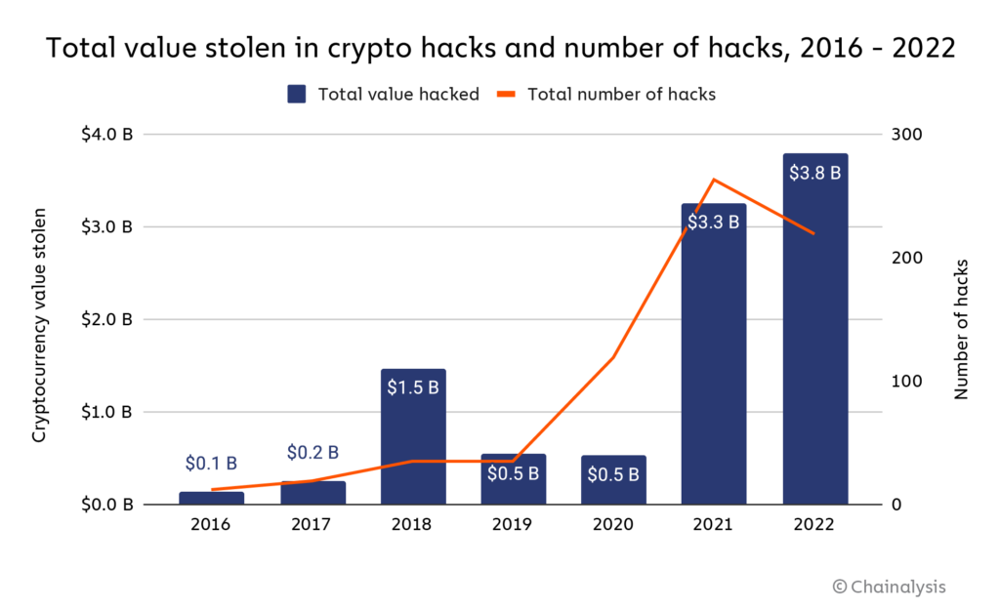

# Diverge-Converge Multi-Phase Audit Model

[Hans Friese](hans@cyfrin.io), [Patrick Collins](patrick@cyfrin.io), [Alex Roan](alex@cyfrin.io)

### Abstract
In this paper, we explore the shortcomings of current audit models and present the Diverge-Converge Multi-Phase Audit (DC MPA), a novel approach aimed at boosting the quality and efficiency of audits in the Web3 sphere.

Our proposed audit model is structured into four essential distinct phases: a traditional audit conducted by a lead (personal auditor or a team of auditors or an audit firm), a public epochal time-boxed bug bounty (PET bug bounty), an exclusive competition, and a final review. Additional phases can be added according to the protocol's preference.

It is worth noting that the new model differs from a simple combination of several single-phase audits. A unique feature of this model is how each phase is interlinked with incentives and disincentives, fostering a spirit of rigorous competition amongst auditors.

Being the first model of its kind to incorporate multiple distinct phases of auditing, we anticipate that it will offer high-quality audits and foresee its wide adoption in the Web3 space.

# 1. Introduction

## 1.1 Background

The Web3 realm, commonly hailed as the next generation of the internet, is characterized by rapid evolution and expansion with many decentralized applications and platforms. These decentralized networks bring forth many advantages including enhanced privacy, resistance to censorship, and a democratized platform for creating value. Nevertheless, they also present unique security challenges that need to be addressed.

The fabric of the Web3 ecosystem is woven with blockchain technologies, smart contracts, and decentralized applications (dApps). Smart contracts stand out as they form the backbone of many Web3 applications, defining the rules and logic for decentralized interactions. Given their self-executing nature and the fact that the actual code is publicly available, smart contracts are highly susceptible to attacks and exploits. The immutable nature of smart contracts also poses a challenge, as any vulnerabilities in the codebase cannot be rectified post-deployment.

According to the report from [Chainalysis](https://www.chainalysis.com/blog/2022-biggest-year-ever-for-crypto-hacking/), $3.8 billion was stolen in 2022. Major hacks and the affected protocols are listed in [rekt.news](https://rekt.news/leaderboard/).

The reality underscores the urgent need for comprehensive and robust security audits in Web3.

Security audits involve scrutinizing the code of smart contracts to detect and rectify vulnerabilities before deployment.

This paper explores the possible shortcomings of current audit models and presents the Diverge-Converge Multi-Phase Audit Model, a novel approach aimed at boosting the quality and efficiency of audits in the Web3 sphere.

## 1.2 Scope and Terminology

This paper primarily focuses on the security aspects of smart contracts and dApps within the Web3 ecosystem **prior** to their deployment. Aspects related to the architectural recommendations during the development and the post-deployment security are not within the purview of this paper.

- The term "**protocol**" in this context denotes the smart contract or dApp that is the subject of the audit.
- The "**client**" refers to the individual or organization that owns the protocol and commissions the audit.
- An "**audit**" signifies inspecting the protocol's code to detect and eliminate vulnerabilities. Generally the terms "audit" and "security review" are used interchangeably but we will use the term "audit" throughout this paper. In a narrow sense, we use the term "audit" to refer to the process of inspecting the protocol's codebase that is ready to be deployed.
- An "**auditor**" denotes the individual or organization entrusted with conducting the audit. Note that we use the term "auditor" to refer to the individual or organization that conducts the audit.
- An "**audit report**" is the conclusive document the auditor produces upon completion of the audit process.
- A "**bug bounty**" is a mechanism to encourage the public to discover vulnerabilities in the protocol. In a traditional bug bounty program, rewards are given only for the first reported instance of a particular vulnerability, with subsequent duplicate reports not being eligible for rewards.
- A "**contest**" is a similar incentive-based process aimed at public participation in finding protocol vulnerabilities. Contrary to bug bounties, contests reward all valid vulnerability submissions.

# 2. Defining a Good Audit Model

In the context of Web3 application security, defining what makes an audit "good" is a crucial discussion.

We suggest that an optimal audit model should meet three fundamental criteria:
- Flawlessness, or **Perfectness**
- Operational effectiveness, or **Efficiency**
- The provision of supplementary benefits, which we categorize as **Plus**.

## 2.1 Perfectness

A high-quality audit aims for an ideal state we define as **Perfectness**. Perfectness represents a scenario where the audited codebase is entirely devoid of vulnerabilities. The quest for perfectness makes the codebase progressively more secure and reliable as we inch closer to this ideal state. The role of auditors is pivotal in this journey - as they dig deeper into the code, unearthing and resolving more bugs and vulnerabilities, the reservoir of potential vulnerabilities diminishes. This ongoing cycle of discovering and resolving vulnerabilities fuels a positive feedback loop in the audit process. Each vulnerability spotted and fixed nudges us nearer to perfectness, establishing a cycle of continuous enhancement toward a secure codebase.

Pursuing audit perfectness encompasses two critical elements: **Exploit Quality** and **Consult Quality**.

- Exploit Quality is a measure of the audit's proficiency in detecting and evaluating potential vulnerabilities in the codebase. The objective is to unearth and address as many vulnerabilities as possible, reducing the remaining vulnerabilities and advancing towards perfectness.

- Consulting Quality, on the flip side, refers to the auditor's capacity to provide insightful advice and recommend best practices that enhance the overall security and robustness of the codebase, thus aiding the progress towards perfectness.

In this paper, we focus more on the exploit quality of the audit while the consulting quality is also essential.

When addressing perfectness, multiple factors contribute to the quality of the audit.

- Top-Tier Engagement
  Engaging auditors with relevant domain knowledge is crucial as their expert knowledge and experience significantly boost the exploit and consult quality of the audit.

- Many Eyes
  The "Many Eyes" principle implies that having a larger pool of auditors reviewing the codebase can enhance the chances of identifying vulnerabilities.

- Duration
  The duration of the audit can influence the audit quality. A longer duration allows auditors to conduct a more thorough review, discovering more vulnerabilities.

- Number of Rounds
  The number of audit rounds can influence the audit quality. Conducting multiple rounds can lead to detecting and resolving more vulnerabilities, thus improving both the exploit quality and consult quality.

- Synergy
  Collaborative brainstorming sessions between auditors and the protocol developers can enhance the audit quality. These sessions allow auditors to leverage each other's expertise and share knowledge, leading to more comprehensive audits.

- Tooling
  Advanced tools like static analyzers can automate certain parts of the audit, improving its efficiency and comprehensiveness.

### The Role of Incentives and Disincentives

An essential consideration in auditing is the dedication of the auditor due to the intensive nature of security audits. When we speak of top-tier engagement, we're referring to a review carried out with high commitment.

This **Dedication** is a vital ingredient in a successful audit. The auditor's level of commitment can be influenced by various factors, including but not limited to the incentives and disincentives for the performance.

Ideally, a system should offer incentives or impose disincentives on the auditor, influenced by specific "metrics". For example, an auditor could be incentivized based on the number of vulnerabilities they uncover, or face disincentives if they fail to adhere to set deadlines. This system of incentives and disincentives is an integral part of the Diverge-Converge Multi-Phase Audit Model, which we will delve into later.

## 2.2 Efficiency

While striving for perfection is vital, it's also essential to maintain efficiency in terms of both turnaround time and cost. A high-quality audit shouldn't excessively delay the protocol's deployment or result in prohibitive expenses, as these factors can hinder innovation and growth within the Web3 ecosystem. It's important to clarify that being efficient doesn't mean rushing deployment. Instead, it's about reducing time and cost while ensuring the protocol's security through thorough efforts. The Diverge-Converge Audit Model is designed to enhance efficiency, minimizing both the time and cost associated with completing an audit.

## 2.3 Plus

A quality audit transcends mere perfection and efficiency, delivering added value through services like:

- **Architectural Review**: Evaluating the overarching system design, possibly including invariant definitions.

- **Review of Documentation**: Review the protocol's documentation to ensure it's comprehensive and accurate.

- **Threat Modelling**: A structured representation of all data affecting the protocol's security, viewing the system from a security perspective.

- **Formal Verification**: Leveraging mathematical logic and reasoning to ensure the system functions correctly under all conceivable scenarios.

- **Test Support**: Aiding in creating a suitable test suite for the protocol, including invariant tests.

- **Recommendation of Monitoring Practices**: Recommending best practices for monitoring the protocol post-deployment.

- **After Sight**: Providing assistance for potential incidents that might emerge after deployment.

Engaging in a prolonged partnership with an auditor or audit firm can benefit clients in the long run, as it often leads to a deeper understanding and more comprehensive support.

## 2.4 Concluding Remarks

In conclusion, when a protocol seeks a security audit, the attributes they prioritize can be ordered as: **Perfectness > Efficiency > Plus**.

Naturally, tension can arise between these different facets of a high-quality audit. For instance, while the involvement of top-tier auditors is desirable, it may pose challenges when coupled with the 'Many Eyes' approach, as the cost could escalate rapidly. Striking a balance between accommodating numerous reviewers and managing cost and efficiency constitutes a complex aspect of the auditing process that warrants careful navigation.

# 3. Review of Current Audit Models

In this section, we delve into existing audit models, discussing their advantages and possible shortcomings with a focus on Perfectness. We would like to note that the analysis is partially based on our subjective estimation, assumption and experience and statements in this section are not backed by any data.

## 3.1 Traditional Audit

The traditional audit is the most frequently adopted model. In this setup, the client contracts an individual auditor or an audit firm to review the protocol.

### 3.1.1 By an Individual Auditor

The client contracts a single personal auditor to scrutinize the protocol. Following the audit, the auditor compiles an audit report, upon which the client updates the protocol codebase to rectify the vulnerabilities detected in the report. Typically, the auditor reviews the mitigation result and provides feedback to the client.

Clients tend to engage auditors who possess a strong reputation within the Web3 space. This is primarily due to the level of trust in the auditor's ability to conduct a comprehensive audit and produce a high-quality audit report. The auditor typically receives a predetermined payment for the audit.

While this model hinges on the auditor's credibility and integrity, we note some of its possible shortcomings.

- First, being a single individual, the auditor may not be equipped to discover all potential vulnerabilities in the protocol, especially if the protocol is complex.

- Second, the audit process is devoid of brainstorming or collaborative input.

It is noticeable that this model is often used as a starting point for protocols, as it is relatively economical and straightforward.

### 3.1.2 By an Audit Firm

The client contracts an audit firm to review the protocol. The audit firm typically comprises a lead auditor, several assistant auditors, and often a project manager. The team engages in numerous brainstorming sessions during the audit process.

The firm carefully selects the auditors based on their expertise and experience, with the lead auditor usually being a highly reputed figure in the Web3 domain. The project manager ensures the audit is conducted promptly and the auditors can focus on the audit process.

The firm may leverage advanced tools and frameworks to automate certain parts of the audit, enhancing the audit's efficiency and quality. While many open-source tools are available, some firms might have developed their own proprietary tools.

The audit firm is typically paid a predetermined fee for the audit, often a lot higher than the fee paid to an individual auditor.

It is noticeable that this model has often been adopted as the last phase before deployment for protocols.

### 3.1.3 Concluding Remarks

The traditional audit model is the most widely adopted in the Web3 space, with many protocols engaging individual or audit firms to conduct security audits.

The process generally consists of two rounds, with the first round involving the auditor reviewing the protocol codebase and producing an initial audit report. The client then updates the protocol codebase to rectify the vulnerabilities identified in the report. The second round involves the auditor reviewing the mitigation result and producing the final audit report.

This model presumably offers a good level of consulting quality, given the auditor's expertise and experience. Also, the protocol often builds a long-term relationship with the auditor or the audit firm, which can benefit both parties.

However, the codebase is inspected by a single auditor or a small team of auditors, which may limit the exploit quality of the audit than the community-based audit models.

## 3.2 Hybrid Model

This model resembles the traditional audit model but differentiates itself by relying on a relatively big pool of auditors and categorizing auditors into various levels, with incentive allocation based on the auditor's level.

### 3.2.1 SpearbitDAO

[SpearbitDAO](https://spearbit.com/) emerged as the inaugural organization to implement this model, winning acclaim for its high-standard audits.

For each audit request, a few lead auditors are selected from a pool of top-tier auditors to conduct the audit alongside associate auditors. While the audit flow mirrors the traditional audit model, SpearbitDAO distinguishes auditors into several levels through a rigorous review process, with lead auditors receiving considerable incentives.

The generous incentive scheme ensures robust engagement from the lead auditors, motivating them to conduct comprehensive and prompt audits. This active involvement from several top-tier auditors culminates in an audit report of high quality.

It's worth noting that SpearbitDAO hosts public brainstorming sessions and retrospective reviews for audits, enabling auditors to learn from each other and enhance their skills.

### 3.2.2 AuditOne

[AuditOne](https://auditone.io/) is another audit platform that assigns audit requests to a pool of auditors based on their expertise and experience.

Auditors join the platform and increase their experience score by participating in audits and Capture The Flag (CTF) events. A unique feature of the platform is that the audit cost undergoes an approval process led by a high-tier auditor. Auditors are incentivized relative to their experience score – higher scores lead to higher incentives.

A team of four auditors is selected from the pool for every audit request based on score and availability. The audit flow parallels that of the traditional audit model.

### 3.2.3 Concluding Remarks

The hybrid model offers several advantages, including:
- There is systematic control over the assignment of auditors, ensuring that the protocol codebase is inspected by auditors with relevant domain knowledge.
- The auditors are incentivized based on their experience score, encouraging them to level up and improve their skills.
- The auditors are from a relatively large pool.

However, the protocol codebase is still inspected by a few auditors, which may limit the exploit quality of the audit compared to the community-based audit models.

## 3.3 Community-Based Audit

This model is a relatively new entrant quickly gaining traction in Web3. Here, the client organizes a contest with a prize pool, incentivizing the public to discover vulnerabilities in the protocol.

Typically, there is no cap on the participant count and the contest is open to all. Code4rena, Sherlock, and CodeHawks are the most frequented platforms for conducting such contests in the Web3 domain, attracting hundreds of auditors to participate. These platforms have successfully hosted numerous contests, with millions of dollars distributed in prizes.

### 3.3.1 Code4rena

[Code4rena](https://code4rena.com/) is the pioneering platform for contest-based audits in the Web3 sphere and enjoys a reputation of high esteem. Each contest held by Code4rena witnesses participation from hundreds of auditors, hoping many reviewers inspect the protocol codebase.

The platform has attracted many auditors, with the prize pool as a powerful incentive. The platform also has been building a solid community of auditors, allowing auditors to leverage each other's expertise and share knowledge.

However, theoretically, there is no guarantee that top-tier auditors with relevant domain knowledge will inspect the protocol codebase, especially when there are multiple ongoing high-prize contests.

Also, the participants are kind of random for every contest and are only engaged for a short time.

### 3.3.2 Sherlock

[Sherlock](https://sherlock.xyz/), another platform utilizing contest-based audits is recognized for its new approach in several areas.

First, the platform has introduced a scoring system for participants. Scores are assigned based on submission quality, and high scorers, designated Senior Lead Watsons, stand to gain a significant portion of the prize pool. This scoring system is a powerful incentive for top-tier auditors to participate in the contests. Indeed, several top-tier auditors have shown active participation in Sherlock contests.

Second, Sherlock introduced an insurance system, the first in the industry. Clients can insure their protocols, with the insurance compensating clients in the event of a hack or exploit. While the effectiveness of this system remains to be seen, it represents a noteworthy advancement in terms of post-deployment support.

However, there still exists similar issues as Code4rena, such as the participants are kind of random for every contest and are only engaged for a short time.

### 3.3.3 Hats Finance
[Hats.finance](https://app.hats.finance/) is another platform that organizes contests and bug bounties.

The most innovative feature of Hats is that it is built on a decentralized infrastructure and most of the processes are governed by the community.

While the platform hosts both contests and bug bounties, we will focus on the contest model. The contest model is fairly unique and different from the other platforms.

- Payment based on findings: Rewards in audit competitions are based on the severity and validity of the vulnerabilities found. This means that if no vulnerabilities are discovered, no payments are required, ensuring that resources are spent effectively.
- First come, first served: Only the first person to find a vulnerability will be rewarded.

All the findings are published as soon as they are identified, allowing auditors to avoid duplicate submissions.

It is notable that the "first come, first served" rule encourages and discourages auditors at the same time. It encourages auditors with a possible high reward, but it also discourages auditors because they may not be rewarded even if they find a vulnerability.

### 3.3.4 CodeHawks

[CodeHawks](https://www.codehawks.com/) is another new platform that organizes contests for auditing protocols.

CodeHawks is still in its infancy with only a few contests conducted so far and many features yet to be implemented. It's too early to gauge its effectiveness with the relatively new platform.

### 3.3.5 Concluding Remarks

The community-based audit model has shown promise, with several platforms organizing contests for auditing protocols. The model has gained traction recently, with many protocols opting for this model over the traditional audit model.

The model offers several advantages, including:
- The protocol codebase is inspected by many auditors, increasing the chances of identifying vulnerabilities.
- The model is relatively economical for the client as the cost is limited to the prize pool and the platform fee while many auditors inspect the protocol.
- The model contributes to forming a solid community of auditors with the prize pool as a powerful incentive.

However, the model also has certain possible drawbacks, including:
- With the rapidly growing number of participants, the incentive to uncover vulnerabilities has diminished significantly, resulting in a possible lack of top-tier engagement.
- Auditors independently traverse the entire process, from document review to codebase scrutiny, with minimal collaboration. This lack of cooperative brainstorming is a notable drawback, as it limits the opportunity for auditors to learn from each other and incurs a waste of time and effort. Furthermore, competition around the prize pool may discourage auditors from sharing knowledge.
- Auditors' engagement is limited to a short period, with no long-term relationship established between the client and the auditor.
- Mitigation on the findings is often (not always) missing and not fully reviewed by the auditors, which may lead to new vulnerabilities being introduced during the mitigation process.

## 3.4 Conclusion

In this section, we delved into an analysis of current audit models, examining their strengths and possible weaknesses.

While all of the models have advantages and disadvantages, one common shortcoming is that each model is limited to a single round involving finding and mitigating vulnerabilities. This single round is often insufficient to ensure the protocol is free from vulnerabilities.

Recently, many protocols have been going through multiple rounds of audits, with the first round being a traditional audit and the second round being a community-based audit. We believe this approach is a step in the right direction, but there is room for improvement because the rounds are entirely independent.

In the next section, we propose a new multi-phase audit model encompassing multiple rounds of audits, each being interlinked with the previous one.

# 4. Diverge-Converge Multi-Phase Audit

A multi-phase audit (MPA) is an approach that involves multiple rounds of audits, with each round being interlinked with the previous one. Each phase is one of the existing audit models, such as a traditional audit, a community-based audit, or a hybrid model and we would call it a single-phase audit (SPA).

Although the term "multi-phase audit" is not widely used, several protocols have adopted a similar approach, with the first round being a traditional audit and the second being a community-based audit.

While one might call a combination of several single-phase audits a multi-phase audit, we believe a multi-phase audit should be a structured approach where each phase is somehow connected.

There can be many ways to design a multi-phase audit model and we propose the Diverge-Converge Multi-Phase Audit (DC MPA in short), a novel approach aimed at boosting the quality and efficiency of audits in the Web3 sphere.

## 4.1 Conceptual Overview

### 4.1.1 Phases of the Diverge-Converge MPA

1. **Traditional Audit by Lead Auditor**: This initial phase involves a lead auditor, who can be an individual or an audit firm, selected based on expertise and experience, represented as a score. The lead auditor is pivotal in the process and is highly incentivized. The lead auditor is regarded as the most responsible party in the audit process and is involved in all phases. We expect the protocols to build a long-term relationship with the lead auditor for future audits.

2. **Public Epochal Time-Boxed Bug Bounty (PET Bug Bounty)**: Public auditors are encouraged to discover and report vulnerabilities in this phase. The bug bounty is time-boxed and open to all, with no limit on participant numbers.
The bounty consists of multiple epochs, each lasting 8~24 hours. Duplicates are permitted within an epoch, but a later epoch won't reward a bug already submitted in a previous epoch. The quality rating is used to determine the reward for duplicate submissions within a single epoch. To prevent premature disclosure, hunters may opt for a "hash submission" where they will initially submit just the hash of their findings and the full details are open to the judges only after a block concludes. The findings are published as soon as possible to help hunters avoid duplicate submissions.
The lead auditor and bounty hunters are implicitly in competition, given the dynamic allocation of the reward pool based on findings. The lead auditor is also involved in this phase and is incentivized to continue exploring the protocol to find more vulnerabilities. Although the lead auditor's findings will not be rewarded as they are considered "known issues from Phase 1", their score will be updated accordingly. The dynamic structure of the reward pool and audit score incentivizes the lead auditor to identify more vulnerabilities.

3. **Selective Competition**: The third phase involves selective competition among top-performed auditors from the previous phases. The main purpose of this phase is to review the mitigations of all the findings from the previous phases. Any new vulnerabilities introduced during the mitigation process should be identified in this phase. It is worth noting that the lead auditor is also involved in this phase and is incentivized to continue exploring the protocol to find more vulnerabilities because their score will be updated accordingly.

4. **Final Review**: The final phase reviews the entire audit process conducted by the HOST and the lead auditor. The lead auditor is encouraged to provide a final system analysis report describing the protocol from a security perspective.

The name _**Diverge-Converge**_ is inspired by the fact that the audit process starts from a single auditor and diverges into a public bug bounty, then converges back to a small group of auditors and finally to a single auditor.

### 4.1.2 Objectives of the Proposed Model

The Diverge-Converge Model emphasizes the following objectives:

- **Top-Tier Engagement**: The model aims to engage top-tier auditors in the whole process by incentivizing them with a fixed percentage of the reward pool. This engagement is crucial as it ensures the audit is conducted by auditors with relevant domain knowledge and experience.

- **Many Eyes**: The model aims to involve many auditors in the audit process via the public bug bounty, increasing the chances of identifying vulnerabilities.

- **Optimized Participation**: The model also aims to provide enough incentives for all participants and optimize auditors' participation. To maximize auditor incentives, the model aims to minimize the number of actually rewarded participants involved in each phase while achieving top-tier engagement and many eyes. This not only increases the rewards for auditors but also reduces the turnaround time of the audit.

- **Long-Term Engagement**: The model aims to support establishing a long-term engagement between the client and the lead auditor by engaging the lead auditor in all phases. This long-term relationship benefits both parties, as the lead auditor gains a deeper understanding of the protocol, while the client can leverage the auditor's expertise and experience in future audits.

- **Information Transfer**: While the model implies a competitive spirit amongst auditors, it also enforces a spirit of collaboration and knowledge sharing by facilitating the transfer of information from one phase to the next, ensuring that all relevant information is passed on to the next. The lead auditor is **required** to share the line-by-line comments and walkthrough explanation of the findings with the public auditors. The codebase is open to the public through the whole process and findings are published as soon as they are identified in the first two phases.

## 4.2 Roles and Terminology

The Diverge-Converge Model engages several roles.

- **Client**: The individual or organization that owns the protocol and commissions the audit. The client bears the audit cost (reward pool).
- **Lead Auditor**: The individual or organization involved in all audit phases. The lead auditor is responsible for conducting a comprehensive audit and producing an audit report and a system analysis report in the first phase. The lead auditor is also responsible for sharing the line-by-line comments and walkthrough explanations of the findings with the community auditors. A fixed percentage of the reward pool highly incentivizes the lead auditor. The lead auditor is also involved across all phases and the dynamic structure of the reward pool and audit score incentivize the lead auditor to identify more vulnerabilities continuously.
- **Bounty Hunter**: The individual or organization participating in the bug bounty. The bug bounty is open to all, with no limit on participant numbers. The lead auditor and bounty hunters are implicitly in competition, given the dynamic allocation of the reward pool based on findings. Valid findings are rewarded if not identified in previous phases and epochs.
- **Contestant**: The individual or organization participating in the selective competition. A small group of auditors, typically 3-5 including the lead auditor, are chosen as contestants based on their performance in previous phases and score. All valid submissions in this time-boxed competition are rewarded regardless of the duplication.
- **Judge**: The individual or organization that evaluates the findings from all phases. The judge, chosen from a reputable group in the Web3 space, is incentivized by a fixed percentage of the reward pool.
- **Host**: The individual or organization overseeing the audit process. The host sets up the audit process and ensures its timely completion. A fixed fee on top of the reward pool incentivizes the host. It is worth noting that the Host holds the final decision-making power in the audit process.

The Diverge-Converge Model also involves several terms.

- **Protocol Difficulty**: Based on subjective estimation and the SLOC and complexity defined by [`solidity-metrics`](https://marketplace.visualstudio.com/items?itemName=tintinweb.solidity-metrics), the Host decides the difficulty score ranging in 0 ~ 1.

- **Exploit Score**: A measure representing the implicit audit quality.
  The exploit score is computed based on the protocol difficulty, the number of findings, the severity, and the phase of the findings.

  The severity of the findings is categorized into three levels: High Risk, Medium Risk, and Low Risk. The Judge determines the findings' severity. Note that we don't include Gas saving findings but an additional phase can be added to the end of Phase 3 according to the protocol's preference. See the "Additional Phases" section for more details.

  Severity points are given as High Risk: 10 points, Medium Risk: 2 points, Low Risk: 0.1 point.
  Phase factor is applied as Phase 1: 0.7x, Phase 2: 1x, Phase 3: 1x.

  The idea behind the points by severity is we value the ability to find severe ones rather than not impactful ones.
  The idea behind the points by phase is it would be easier to find bugs at an early phase than at a later phase.

  The final exploit score is calculated as follows:
  $ES=C_p*C_d*(N_H*10+N_M*3+N_L)$, where $C_p$ and $C_d$ represent the phase factor and protocol difficulty.

  _Example_. If an auditor found H3 M2 L10 in phase 1 and the difficulty is 0.8, the exploit score will be $0.7*0.8*(3*10+2*3+0.1*10)=20.72$.

- **Lead Performance Score**: A measure representing the performance of the lead auditor. Calculated based on the lead auditor's exploit score ($ES_L$) ratio to the other auditors' exploit score($ES_P$) for all phases. After the audit, the lead performance score is calculated as $LS_P=ES_L/ES_P$, capped to [0, 2]. The lead performance score is used to update the auditor score for the lead auditor.

- **Lead Collaboration Score**: A measure representing the collaboration of the lead auditor. The Host evaluates the lead auditor's collaboration level based on the line-by-line comments and walkthrough explanation of the findings shared with the public auditors. A score $LS_C$ ranging in -10~10 is given to the lead auditor based on the evaluation and the score is included in the final audit score of the lead auditor.

- **Auditor Score**: A measure representing the auditor's expertise and experience used to select the lead auditor and the contestants. When all phases are finished, exploit scores are calculated for all auditors involved in the process, and the performance and collaboration scores are calculated for the lead auditor.

  Finally, the auditor score is updated as follows:
  $AS = AS + ES * (LS_P-1) + LS_C$ for the lead auditor
  $AS = AS + ES$ for other auditors.

  We note that the performance score can increase and decrease the auditor score for the lead auditor because $LS_P$ is capped to [0, 2].

**NOTE** All formulas and parameters are only for illustration purposes and are not backed by any data. These need to go through actual experiments and be tuned.

## 4.3 Phases in Detail

### 4.3.1 Phase 1: Traditional Audit by Lead Auditor

#### Inputs

The Protocol team should provide the source code repository access along with all supportive documentation (papers, manuals, diagrams, etc.) that could be helpful for the audit. All the inputs are also open to the public to allow the public auditors to access them as early as possible.

#### Duration

The lead auditor provides the Host with an initial estimation of the necessary duration for this phase. The duration tends to be a tight estimate as the next phase will have the same duration, while the lead auditor can win the dynamic pool if he outperforms the public auditors. This estimated duration is denoted as $L_P$. The Host decides the duration based on the protocol's complexity and the lead auditor's estimation. Note that this duration estimation is vital, as it affects the total cost of the audit and is usually determined during the negotiation between the Client and the Host.

#### Execution

The first phase is a traditional audit by a lead auditor, who could be an individual or an audit firm. The selection of a lead auditor is based on their expertise and experience, generally represented as an Auditor Score. However, the Host can also consider other factors such as the auditor's availability and the Client's preference.

The lead auditor, engaged in all the phases and playing a vital role in the audit process, is heavily incentivized with a fixed guaranteed percentage of the reward pool.

In this phase, the lead auditor's responsibility is to conduct a comprehensive audit, producing an audit report and a system analysis report. The audit process is similar to a traditional audit model, with the protocol development team involved to assist the lead auditor in understanding the protocol.

Due to the dynamic structure of the reward pool, the lead auditor is heavily incentivized to conduct a thorough audit, as the more vulnerabilities left undiscovered, the lesser the reward will be. Furthermore, the lead auditor's performance score affects the final auditor score, encouraging them to uncover as many issues as possible.

The entire audit process should be transparent, with findings accessible to anyone as soon as they are identified. This allows the protocol development team to begin mitigation immediately as well.

Once the audit is complete, the lead auditor must deliver the Audit Report V1.0, which contains all the findings and recommended mitigation steps. The protocol team must address all findings (either fix or acknowledge them) and provide the Audit Report V1.1, containing all responses to the lead auditor. The lead auditor checks the mitigation comments from the protocol and publishes the Audit Report V1.2 with his responses to all comments. At this point, phase 1 of the audit is concluded. The lead auditor must also provide an initial system analysis report, System Analysis Report V1, which describes the protocol from a security perspective.

Furthermore, the lead auditor must share the line-by-line comments and walkthrough explanations of the findings with the public auditors. This facilitates the transfer of information from one phase to the next, ensuring that all relevant information is passed on to the next phase. It is worth noting that the lead auditor might have conflicts of interest in sharing the information with the public auditors, but the Host can enforce this requirement by contract and utilizing the collaboration score.

#### Judging

The Judge decides the validity and severity of the findings. The Host may assist in triaging the findings and aiding the Judge in decision-making if necessary. Notably, neither of the protocol team nor the lead auditor is the final decision maker. The judging is done in parallel with the audit process and the findings are published as soon as they are identified.

#### Outputs

The outputs of this phase include:

- Audit Report V1.2
  The report contains all findings and recommendations from the lead auditor.
- System Analysis Report V1
  The lead auditor is responsible for writing a brief system analysis report describing the protocol from a security perspective.
- Repository with all comments from the lead auditor
  Auditors usually leave comments to facilitate their understanding and mark the process. This is a valuable asset that can significantly assist other auditors. The lead auditor is required to leave comments in a kind of standard format to help other auditors.
- Video recording of the protocol walkthrough/brainstorm/QA by the lead auditor
  Once the initial audit report V1.0 is delivered, the Host arranges a session in which the lead auditor explains the protocol and answers questions from other auditors if any. This session is recorded and published to assist other auditors in subsequent phases.

### 4.3.2 Phase 2: Public Epochal Time-Boxed Bug Bounty

#### Inputs

All outputs from Phase 1 are transferred to Phase 2. A communication channel is also established between the protocol team and the public auditors to facilitate dialogue.

#### Duration

This phase is a public epochal time-bound bug bounty (PET Bug Bounty). The duration is typically the same as the duration allotted to the lead auditor, ensuring that the public auditors have ample time to review the protocol and identify vulnerabilities. As they begin with the lead auditor's comments, walkthrough explanation, and the audit report, this time is expected to be sufficient. Furthermore, the codebase is open to the public from the beginning of Phase 1, allowing the public auditors to access it earlier.
We denote the bounty duration as $L_B$ and by default, we assume $L_B = L_P$. The Host can adjust the bounty duration if necessary according to various factors such as the protocol's complexity.

#### Execution

Any public auditor can participate in this phase without any participant limit.

Unlike other public bug bounty models, this phase is strictly time-boxed and consists of multiple epochs, each lasting 8~24 hours. The duration of each epoch is determined by the Host, with the default assumption of 8 hours. The Host can adjust the epoch duration if necessary.

Duplicate submissions are permitted within an epoch, but a later epoch won't reward a bug already submitted in a previous epoch. The quality rating (granted by the Judge) is used to determine the reward for duplicate submissions within a single epoch. The reason for allowing duplicates within an epoch is to encourage more hunters to submit their findings because they have a chance to win the reward even if they are not the first to find the bug. Leveraging the quality rating to "sort" the findings ensures that the submissions are high quality and the reward is allocated to the most deserving hunter.

To prevent premature disclosure, hunters can opt for a "hash submission" where they will initially submit just the hash of their findings and the full details are open to the judges only after a block concludes. The findings are published as soon as possible to help hunters avoid duplicate submissions.

The judgment process is transparent and allows for an appeal from auditors if they disagree with the judges. To aid judges in understanding the findings, auditors are strongly encouraged to provide a proof of concept (PoC). In this phase, only the High and Medium risk findings are considered.

Valid findings are published on the finding board as soon as they are identified, allowing the protocol team to initiate mitigation immediately.

The lead auditor is also involved in this phase and is incentivized to continue exploring the protocol to find more vulnerabilities. Although the lead auditor's findings will not be rewarded as they are considered "known issues from Phase 1", their score will be updated accordingly. The dynamic structure of the reward pool and audit score incentivizes the lead auditor to identify more vulnerabilities.

By the dynamic structure of the reward pool, the public auditors are incentivized enough to conduct a thorough audit. On the other hand, there are likely few vulnerabilities left undiscovered assuming the lead auditor has done an excellent job. This gives a chance for the public auditors to win a high reward with a single submission.

Once the bounty period is over (all epochs are finished and judged), the Host delivers the Audit Report V2.0, containing all findings and recommended mitigation steps. The protocol team must address all findings (either fix or acknowledge them), and deliver the Audit Report V2.1, containing all responses to the findings.

This phase does **NOT** have a mitigation review process; this will be conducted in the next phase.

**NOTE 1:** Public auditors are encouraged to submit any findings that arise after the bounty period. These findings will be reviewed at the end of Phase 3 and, if not covered elsewhere, will be rewarded as part of the contest pool.

**NOTE 2:** The term PET Bug Bounty can be replaced with other terms such as "Public Epochal Contest" because it is essentially a generalization of the existing bug bounty models and public contest models. If the epoch duration is the same as the whole duration, it is equivalent to a public contest. If the epoch duration is zero and the whole duration is infinite, it equals a traditional bug bounty.

#### Judging

The Judge determines the validity and severity of the findings. The Host may assist in triaging the findings and aiding the Judge in decision-making if necessary. Notably, neither the protocol team nor the lead auditor is the final decision maker. The Judge gets access to the full details of the findings of the previous epoch only after the epoch concludes. The judging is done in parallel with the bounty process and the findings are published as soon as they are identified.

#### Outputs

The output of this phase is the Audit Report V2.0, containing all findings.

### 4.3.3 Phase 3: Selective Competition

This phase is primarily focused on reviewing the mitigations of all the findings from the previous phases. Any new vulnerabilities introduced during the mitigation process should be identified in this phase.

#### Inputs

All outputs from Phases 1 and 2 are transferred to Phase 3.

A small group of auditors, typically 3-5 including the lead auditor, are chosen as contestants based on their performance in the Phase 2 and their auditor score.

A new communication channel is opened between the protocol team and the contestants.

#### Duration

This phase is a time-bound selective competition. The Host, in consultation with the lead auditor, estimates the necessary duration for this phase, typically recommended to be between 3 to 7 days. We denote the contest duration as $L_C$, with a default assumption of $L_C = 5$. The Host can adjust the contest duration if necessary.

#### Execution

The chosen contestants review the mitigated protocol and aim to find any additional vulnerabilities. The findings are not limited to mitigated issues, and contestants are encouraged to find any vulnerabilities in the protocol. All severity levels are considered in this phase.

The lead auditor continues their involvement in this phase and is incentivized to find more vulnerabilities. The lead auditor's findings are rewarded as part of the contest pool and will affect their performance score.

After the contest concludes, a judging period commences during which the judges review all findings from the contestants and the lead auditor. They determine the validity and severity of the findings. The judging process is transparent, allowing auditors to appeal their findings.

Once judging begins, any additional submissions (after the public bounty time has concluded) are published, and the contestants collaborate with the judges to evaluate these findings. Contestants are interested in this process as these findings will influence the final distribution of the reward pool.

Once judging concludes, the Host delivers the Audit Report V3.0, containing all findings and recommended mitigation steps. The protocol team must address all findings (either fix or acknowledge them), and deliver the Audit Report V3.1, containing all responses to the findings. The lead auditor then delivers Audit Report V3.2, containing responses to mitigation comments.

#### Judging

The Judge determines the validity and severity of the findings. The judging is started after the contest concludes and the findings are published. Judges are incentivized to complete the judging process on time. We denote the judging duration as $L_J$, with a default assumption of $L_J = 3$. The Host can adjust the judging duration if necessary. It's noteworthy that this contest is very likely to involve only a smaller number of findings.

#### Outputs

The output of this phase is the Audit Report V3.2, containing all findings and comments regarding the fixes.

### 4.3.4 Phase 4: Final Review

The Host reviews the entire process and generates the final audit process report. The lead auditor is encouraged to revise the system analysis report based on a deeper understanding of the protocol acquired during the process. We denote the duration of this phase as $L_F$ with a default assumption of $L_F = 2$.

## 4.4 Reward Pool Structure

The Client bears the cost of the audit, referred to as the reward pool, and the Host organizes the structure of the reward pool. The reward pool structure is dynamically designed to incentivize the auditors and adequately maximize the quality of audits. The Host is assumed to charge a fixed fee in addition to the reward pool.

- **Lead Auditor**: The lead auditor is greatly incentivized with a fixed guaranteed percentage ($P_L\%$) of the reward pool. It is recommended that $20 \leq P_L < 50$.
- **Bug Bounty**: A fixed percentage ($P_B\%$) of the reward pool is reserved for the bug bounty and is used to incentivize the public to identify vulnerabilities in the protocol **AFTER** the mitigation of findings from the first phase. It is recommended that $P_L \leq P_B < 50$. The bug bounty pool is distributed to the lead auditor if no vulnerabilities are found during the bug bounty phase.
- **Dynamic Pool**: A fixed percentage ($P_D\%$) of the reward pool is reserved as a dynamic pool. This pool will be rewarded to the lead auditor or the bounty hunters based on the lead auditor's performance. It is recommended that $P_D = 50 - P_L$.
- **Selective Competition Pool**: A fixed percentage ($P_C\%$) of the reward pool is reserved for the selective competition pool and is used to incentivize the contestants to identify vulnerabilities in the protocol **AFTER** the mitigation of findings from the second phase. It is recommended that $10 \leq P_C \leq 15$. As this phase allows for LOW risks, this pool will likely always be distributed to the contestants.
- **Judge**: The judge is involved in all phases and incentivized by a fixed guaranteed percentage ($P_J\%$) of the reward pool. It is recommended that $5 \leq P_J \leq 15$.

### Default Pool Structure

The default pool structure is assumed to be $P_L=30$, $P_B=30$, $P_D=20$, $P_C=10$, $P_J=10$.

## 4.5 Process Overview

The overall process is as follows, assuming the default pool structure.

| Phase                    | Reward     | Participant       | Duration   | Result                                                            |
| ------------------------ | ---------- | ----------------- | ---------- | ----------------------------------------------------------------- |
| Traditional Audit by Lead Auditor            | 30% (+20%) | Lead Auditor      | $L_P$ days | Audit Report V1.2, System Analysis Report V1, Commented Repo, Walkthrough Video |
| PET Bug Bounty | 30% (+20%) | Public            | $L_B$ days | Audit Report V2.0                                                   |
| Selective Contest        | 10%        | Selected Auditors | $L_C$ days | Audit Report V3.1                                                   |
| Final Review             | 0          | Lead Auditor      | $L_F$ days | Final Audit Report, Final System Analysis Report                  |

## 4.6 Estimation of Time and Cost

The entire process's cost can be estimated starting from the lead auditor's price and engagement duration.

As previously mentioned, the lead auditor estimates the duration for Phase 1 as $L_P$ days, and the Host sets the time for the remaining phases as $L_B$, $L_C$, and $L_F$ days. Due to the dynamic pool structure, the lead auditor is motivated to estimate the duration accurately.

Let's assume the lead auditor's daily cost for 100% dedication is $C_L$.

We estimate the lead auditor's dedication for each phase: $D_P = 100\%$, $D_B = 50\%$, $D_C = 100\%$, $D_F = 0\%$.

The total cost for the lead auditor can be estimated as $C_L * (L_P * D_P + L_B * D_B + L_C * D_C) = C_L * (L_P + L_B/2 + L_C)$.

Assuming the lead auditor outperforms the public auditors, the lead auditor will receive $P_L + P_D\%$ of the reward pool (50% for the default structure). So, we can estimate the entire reward pool (i.e., the total cost) as $C_L * (L_P + L_B/2 + L_C) * 100 / (P_L + P_D)$.

The total turnaround time can be estimated as $L_P + L_B + L_C + L_J + L_F$ days.

_Example_
Assuming the lead auditor's engagement cost is $C_L = 2000\$$ per day and he estimated the duration for Phase 1 as $L_P = 10$ days. With the default pool structure and the duration of other phases as $L_B = L_P = 10$, $L_C = 5$, the total cost would be $2000 * (10 + 10/2 + 5) * 100 / (30 + 20) = \$80,000$, and the complete turnaround would be approximately a month probably including the mitigation turnaround.

## 4.7 Additional Phases
The Diverge-Converge model is flexible and can be adjusted to suit the protocol team's needs.
For instance, the Client may add a phase to the audit process to address gas optimization issues.
The Client might also want to have another round of review from a reputable audit firm after Phase 3 to get advice on the system architecture and deployment.
Theoretically, the more rounds of review, the better the audit quality. However, the cost of the audit will increase accordingly. The Client should carefully consider the trade-off between price and quality.

## 4.8 Summary

In this section, we proposed the Diverge-Converge Multi-Phase Audit Model, which strives to maximize audit quality by incentivizing auditors appropriately and ensuring the protocol codebase undergoes at least three audit phases. The proposed model has several advantages:

- The protocol codebase undergoes at least three audit phases. This sequence, connected via a set of incentives and disincentives, is not equivalent to three separate audits; instead, it creates a potent competition among auditors.
- The model ensures audit quality by properly incentivizing auditors. In particular, the lead auditor is highly incentivized, securing top-tier engagement critical for high-quality audits. Moreover, the dynamic reward pool structure also incentivizes public auditors. Depending on performance, a single public auditor could earn more than the lead auditor theoretically. The innovative reward pool structure is a crucial strength of the model to achieve top-tier engagement and "many eyes".
- The model is efficient. Transferring all information from one phase to the next increases audit process efficiency. Findings are published immediately, enabling the protocol team to start mitigation immediately.
- The model's core is transparent and fair. Auditors can communicate with each other, the protocol team, and the judges throughout the audit.
- The lead auditor's extended engagement helps the protocol team build a long-term relationship with them.
- The flexible model can be adjusted to suit the protocol team's needs. For instance, Phase 2 could be performed by a limited number of auditors instead of a public community. An individual auditor or an audit firm could perform phase 1.

# 5. Conclusion

This paper presents an overview of existing audit models in Web3, proposing a new, innovative model known as the Diverge-Converge Multi-Phase Model. This model is crafted to maximize the quality of audits, a critical aspect in the Web3 space. By strategically incentivizing auditors and ensuring that the protocol codebase goes through at least three comprehensive auditing phases, the model aims to enhance audit quality significantly.

The unique strength of the Diverge-Converge Model lies in its ability to foster robust competition among auditors, backed by a dynamic reward pool structure. This structure ensures the engagement of top-tier auditors and encourages their continuous involvement throughout the process. Furthermore, the model emphasizes transparency, promoting efficient communication among auditors, the protocol team, and judges.

The Diverge-Converge Multi-Phase Audit Model introduces a novel approach to auditing in the Web3 space, addressing the possible shortcomings of existing models while presenting its unique advantages. As Web3 continues to grow and evolve, this model could serve as a new standard, guiding the way toward more effective and high-quality audits. Further experiments and implementations of this model will provide more insights and potential enhancements, contributing to the continuous improvement and refinement of auditing practices in the Web3 space.

# 6. Acknowledgments
We sincerely thank the entire [Cyfrin](https://www.cyfrin.io/) team for their invaluable contributions and advice. Their insights and expertise were instrumental in refining and enhancing our ideas. Additionally, special thanks to [Josselin Feist](https://twitter.com/Montyly) from [Trail of Bits](https://www.trailofbits.com/) and [Tincho](https://twitter.com/tinchoabbate) for reviewing the paper and offering valuable insights and advice.

# 7. References

- [1] [DeFi Security Summit 2023 - Session 16: Audits Conventional vs Community Panel](https://www.youtube.com/watch?v=_Yul_fHUjr8&list=PL5r4vTR0gHj5JL62S9R0umY64ue6mfQhd&index=43)
- [2] [Code4rena](https://code4rena.com/)
- [3] [Sherlock](https://sherlock.xyz/)
- [4] [Hats.finance](https://app.hats.finance/)
- [5] [SpearbitDAO](https://spearbit.com/)
- [6] [AuditOne](https://auditone.io/)
- [7] [Solidity Metrics](https://marketplace.visualstudio.com/items?itemName=tintinweb.solidity-metrics) by [Consensys](https://www.consensys.net/)
- [8] [Report 2022](https://www.chainalysis.com/blog/2022-biggest-year-ever-for-crypto-hacking/) by [Chainalysis](https://www.chainalysis.com/)
