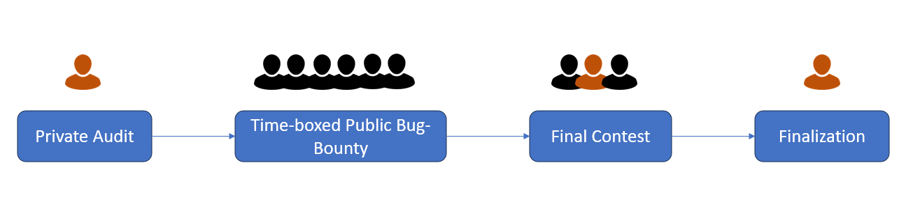
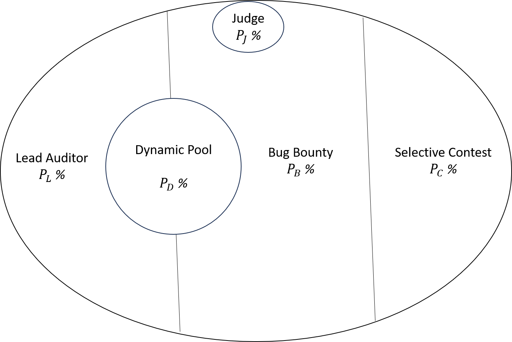

# Diverge-Converge Audit Model

Hans
hans@cyfrin.io

### Abstract

This whitepaper delves into the exploration of various audit models that are pertinent to Web3 security. In our examination, we weigh the advantages and disadvantages of each model and introduce a novel model that is designed to reach the pinnacle of audit quality.

Our proposed audit model is structured into three distinct phases: an initial solo audit conducted by a lead auditor, a public time-boxed bug bounty program, and an exclusive auditor competition.

In each of these phases, an audit report is generated which helps update and fortify the protocol codebase by addressing the vulnerabilities discovered in the preceding phase.

A unique feature of this model is the way each phase is interlinked with a set of incentives and disincentives, fostering a spirit of rigorous competition amongst auditors.

This model is meticulously crafted to enhance the efficiency of the audit process, striving to minimize both the time and cost associated with the completion of the audit.

Being the first model of its kind to incorporate multiple distinct phases of auditing, we anticipate that it will offer unmatched quality in audits and foresee its wide adoption in the Web3 space.

# 1. Introduction

## 1.1 Background

The Web3 realm, commonly hailed as the next generation of the internet, is characterized by rapid evolution and expansion with a multitude of decentralized applications and platforms. These decentralized networks bring forth a host of advantages including enhanced privacy, resistance to censorship, and a democratized platform for creating value. Nevertheless, they also present unique security challenges that need to be addressed.

The fabric of the Web3 ecosystem is woven with blockchain technologies, smart contracts, and decentralized applications (dApps). Smart contracts stand out as they form the backbone of many Web3 applications, defining the rules and logic for decentralized interactions. Given their self-executing nature and the fact that the agreement terms are hard-coded, they become immutable once deployed. This immutability implies that post-deployment, any existing vulnerabilities or bugs in the contract cannot be rectified, turning them into attractive targets for hackers.

_TODO: Expand on Web3, smart contracts, and notorious security breaches._

The issue of Web3 security has been thrust into the spotlight due to numerous high-profile hacking incidents. Notable among these are the DAO hack in 2016 that led to the theft of 3.6 million Ether, then worth \$50 million, owing to a re-entrancy vulnerability in the smart contract. Similarly, the Parity wallet hack in 2017 resulted in losses exceeding \$300 million due to a flaw in the multi-sig wallet contract. In more recent times, the DeFi sector has been rocked by a series of exploits and hacks, with the total value locked (TVL) in DeFi protocols soaring into the billions. As reported by Atlas VPN, cryptocurrency thefts in 2021 alone were close to $10.5 billion, marking a staggering 900% increase from 2020 [1].

These incidents underscore the urgent need for comprehensive and robust security audits in the Web3 space. Security audits involve scrutinizing the code of smart contracts and dApps to detect and rectify vulnerabilities prior to deployment. However, traditional audit methods have fallen short in the face of the complexity and rapid development pace within the Web3 ecosystem.

This whitepaper explores the shortcomings of current audit models and presents the Diverge-Converge Audit Model, a novel approach aimed at boosting the quality and efficiency of audits in the Web3 sphere.

## 1.2 Scope and Terminology

This paper primarily focuses on the security aspects of smart contracts and dApps within the Web3 ecosystem prior to their deployment. Aspects related to post-deployment security are not within the purview of this paper.

- The term "**protocol**" in this context is used to denote the smart contract or dApp that is the subject of the audit.
- The "**client**" refers to the individual or organization that possesses ownership over the protocol and commissions the audit.
- An "**audit**" signifies the procedure of inspecting the protocol's code with the aim of detecting and eliminating vulnerabilities.
- An "**auditor**" denotes the individual or organization entrusted with the task of conducting the audit.
- An "**audit report**" is the conclusive document produced by the auditor upon completion of the audit process.
- A "**bug bounty**" is a mechanism to encourage the public to discover vulnerabilities in the protocol. In a bug bounty program, rewards are given only for the first reported instance of a particular vulnerability, with subsequent duplicate reports not being eligible for rewards.
- A "**contest**" is a similar incentive-based process aimed at public participation in finding protocol vulnerabilities. Contrary to bug bounties, contests reward all valid vulnerability submissions.

# 2. Defining a Good Audit Model

In the context of Web3 application security, defining what makes an audit "good" is a crucial discussion. We suggest that an optimal audit model should meet three fundamental criteria: flawlessness, or **Perfectness**; operational effectiveness, or **Efficiency**; and the provision of supplementary benefits, which we categorize as **Plus**.

## 2.1 Perfectness

A high-quality audit aims for an ideal state we define as **Perfectness**. Perfectness represents a scenario where the audited codebase is entirely devoid of vulnerabilities. The quest for perfectness makes the codebase progressively more secure and reliable as we inch closer to this ideal state. The role of auditors is pivotal in this journey - as they dig deeper into the code, unearthing and resolving more bugs and vulnerabilities, the reservoir of potential vulnerabilities diminishes. This ongoing cycle of discovery and resolution of vulnerabilities fuels a positive feedback loop in the audit process. Each vulnerability spotted and fixed nudges us nearer to perfectness, thereby establishing a cycle of continuous enhancement towards a totally secure codebase.

The pursuit of audit perfectness encompasses two critical elements: **Exploit Quality** and **Consult Quality**.

- Exploit Quality
  Exploit Quality is a measure of the audit's proficiency in detecting and evaluating potential vulnerabilities in the codebase. The objective is to unearth and address as many vulnerabilities as possible, reducing the pool of remaining vulnerabilities and advancing towards perfectness.

- Consult Quality
  Consult Quality, on the flip side, refers to the auditor's capacity to provide insightful advice and recommend best practices that enhance the overall security and robustness of the codebase, thus aiding the progress towards perfectness.

When addressing perfectness, multiple factors contribute to the quality of the audit.

- Top-Tier Engagement
  Engaging a top-tier auditor in the process is invaluable, as their expert knowledge and experience significantly boost the exploit and consult quality of the audit.
- Many Eyes
  The "Many Eyes" principle implies that having a larger pool of auditors reviewing the codebase can enhance the chances of identifying vulnerabilities.
- Number of Rounds
  The quantity of audit rounds can influence the audit quality. Conducting multiple rounds can lead to the detection and resolution of more vulnerabilities, thus improving the exploit quality.
- Brainstorming
  Organizing brainstorming sessions among auditors can enhance the audit quality. These sessions allow auditors to leverage each other's expertise and share knowledge, leading to more comprehensive audits.
- Tooling
  Employing advanced tools like static analyzers can automate certain parts of the audit, improving its efficiency and comprehensiveness.

### The Role of Incentives and Disincentives

An essential consideration in auditing is the dedication of the auditor. When we speak of top-tier engagement, we're referring to a review that's carried out with a high level of commitment. This **Dedication** is a vital ingredient in a successful audit. Ideally, there should be a system that offers incentives or imposes disincentives on the auditor, influenced by specific "metrics". For example, an auditor could be incentivized based on the number of vulnerabilities they uncover, or face disincentives if they fail to adhere to set deadlines. This system of incentives and disincentives is an integral part of the Diverge-Converge Audit Model, which we will delve into later.

## 2.2 Efficiency

While striving for perfectness is crucial, it's equally important to ensure efficiency, in both the turnaround time and cost. A superior audit is one that doesn't excessively delay the protocol's deployment or incur exorbitant costs, as these can stifle innovation and growth in the Web3 ecosystem. The Diverge-Converge Audit Model is architected to optimize efficiency, minimizing both the time and cost associated with the completion of the audit.

## 2.3 Plus

A quality audit goes beyond perfectness and efficiency, providing added value through services such as **Test Support** – assisting in the development of an appropriate test suite for the protocol, and **After Sight** – offering support for potential incidents that may arise post-deployment. This often entails a long-term engagement with an auditor or an audit firm, which can prove advantageous for the client over time.

## 2.4 Conclusing Remarks

In conclusion, when a protocol seeks an auditor's expertise, the attributes they prioritize can be ordered as: **Perfectness > Efficiency > Plus**.

Naturally, tension can arise between these different facets of a high-quality audit. For instance, while the involvement of top-tier auditors is desirable, it may pose challenges when coupled with the 'Many Eyes' approach, as the cost could escalate rapidly. Striking a balance between accommodating numerous reviewers and managing cost and efficiency constitutes a complex aspect of the auditing process that warrants careful navigation.

# 3. Assessment of Current Audit Models

In this section, we delve into existing audit models, discussing their strengths and weaknesses, considering factors such as perfectness, efficiency, and added value.

## 3.1 Individual Solo Audit

The individual solo audit approach represents the most basic model of auditing. Here, a single personal auditor is contracted by the client to scrutinize the protocol. Following the audit, the auditor compiles an audit report, upon which the client updates the protocol codebase to rectify the vulnerabilities detected in the report.

Clients tend to engage auditors who possess a strong reputation within the Web3 space. This is primarily due to the level of trust in the auditor's ability to conduct a comprehensive audit and produce a high-quality audit report. The auditor typically receives a predetermined payment for the audit.

While this model hinges on the auditor's credibility and integrity, it has several shortcomings.

First, being a single individual, the auditor may not be equipped to discover all potential vulnerabilities in the protocol. The audit process is devoid of brainstorming or collaborative input.

Second, the fixed payment structure may not serve as an adequate incentive for the auditor to conduct an exhaustive and timely audit.

Third, the process may lack the support of advanced tooling. The auditor may not have the latest tools or frameworks at their disposal to conduct the audit effectively.

Despite these limitations, the individual solo audit approach is the most economical model and may be suitable for smaller projects with constrained resources. Notably, this approach is frequently used in combination with other audit models.

## 3.2 Conventional Private Audit

The conventional private audit approach is the most frequently adopted model. In this setup, the client contracts an audit team to review the protocol.

The audit team typically comprises a lead auditor, several assistant auditors, and often a project manager. The team engages in numerous brainstorming sessions during the audit process. The lead auditor is usually a highly reputed figure in the Web3 domain. The project manager ensures the audit is conducted in a timely fashion, overseeing the audit process. Additionally, the team generally has access to the most up-to-date tools and frameworks, bolstering the quality of tooling support.

Nevertheless, this model also rests heavily on the reputation and integrity of the audit team and shares similar shortcomings with the individual solo audit approach. Although multiple auditors participate, each individual auditor might not be incentivized to conduct a comprehensive and prompt audit, as their compensation is predetermined by the firm.

This model has been used to audit the majority of protocols deployed in the Web3 space, with the audit reports frequently made public.

Unfortunately, there are instances where protocols audited using this model have been compromised or exploited post-deployment.

## 3.3 Crowd-Sourced Contest-Based Audit Model

This model is a relatively new entrant, quickly gaining traction in the Web3 space. Here, the client organizes a contest with a prize pool, incentivizing the public to discover vulnerabilities in the protocol.

Typically, there is no cap on the participant count and the contest is open to all. Code4rena and Sherlock stand out as the most frequented platforms for conducting such contests in the Web3 domain, attracting hundreds of auditors to participate. Both platforms have successfully hosted numerous contests, with millions of dollars distributed in prizes.

### 3.3.1 Code4rena

[Code4rena](https://code4rena.com/) holds the distinction of being the pioneering platform for contest-based audits in the Web3 sphere and enjoys a reputation of high esteem. Each contest held by Code4rena witnesses participation from hundreds of auditors, ensuring the protocol codebase is inspected by numerous reviewers. It's notable that contests hosted by Code4rena often yield a higher number of findings compared to conventional private audits. By discouraging duplicate submissions, Code4rena motivates participants to uncover unique vulnerabilities in the protocol codebase.

In terms of efficiency, Code4rena represents an effective audit model, enabling the protocol codebase to be inspected by a multitude of reviewers within a relatively short timeframe and at a lower cost. The platform also offers a degree of tooling support.

However, Code4rena faces substantial challenges with respect to achieving perfectness.

The incentive to uncover vulnerabilities has considerably diminished, a significant issue given the rapidly increasing participant count in Code4rena contests. Moreover, changes to the prize pool distribution structure have resulted in a smaller share for actual auditors. These factors have led to many top-tier auditors shifting away from Code4rena contests to other platforms or organizations. The absence of top-tier engagement negatively impacts the exploit quality of the audit, despite Code4rena's assertion that new, proficient auditors continually join their contests.

Criticism has also been directed at the unilateral judging model, which has deterred participants from joining the contests. The judging process lacks transparency, and participants are unable to appeal the results.

### 3.3.2 Sherlock

[Sherlock](https://sherlock.xyz/), another platform for contest-based audits, has been gaining popularity in recent times.

Sherlock is recognized for its innovative approach in several areas.
First, the platform has introduced a scoring system for participants. Scores are assigned based on submission quality, and high scorers, designated Senior Lead Watsons, stand to gain a significant portion of the prize pool. This scoring system serves as a powerful incentive for top-tier auditors to participate in the contests. Indeed, several top-tier auditors have shown active participation in Sherlock contests.
Second, Sherlock introduced an insurance system, a first in the industry. Clients can insure their protocols, with the insurance compensating clients in the event of a hack or exploit. While the effectiveness of this system remains to be seen, it represents a noteworthy advancement in terms of post-deployment support.
Third, Sherlock has brought in a community-based judging model.

However, debates surrounding the system's fairness persist, given the privilege granted to the lead auditor to influence judging decisions (though not directly). It is observed that majority of the prize pool is often rewarded to the lead auditor on top of their fixed percentage of the reward pool. This has discouraged participants from joining the contests, resulting in a lower participant count compared to Code4rena contests.

### 3.3.3 Prevalent Issues

Despite the high efficiency of the crowd-sourced contest-based audit model, it is not without its share of issues.

- Often, the audit is conducted as a singular event, with no follow-up review to verify the rectification of identified vulnerabilities unless the client requests and pays for a separate review. This presents a significant issue as the protocol codebase isn't scrutinized post-mitigation.
- Auditors independently traverse the entire process, from document review to codebase scrutiny, with minimal collaboration. This lack of cooperative brainstorming is a notable drawback, as it limits the opportunity for auditors to learn from each other.
- The model's reward structure often results in diminished returns for duplicate submissions. This can lead to a situation where a critical finding fetches a small reward, while an edge-case of medium risk earns a larger reward.

## 3.4 Hybrid Audit Model

This model bears resemblance to the conventional private audit model, but differentiates itself by categorizing auditors into various levels, with incentive allocation based on the auditor's level.

### 3.4.1 SpearbitDAO

[SpearbitDAO](https://spearbit.com/) emerged as the inaugural organization to implement this model, winning acclaim for their high-standard audits.

For each audit request, one or two lead auditors are selected from a pool of top-tier auditors to conduct the audit alongside associate auditors as a team. While the audit flow mirrors that of the conventional private audit model, SpearbitDAO distinguishes auditors into several levels through a rigorous review process, with lead auditors receiving considerable incentives.

The generous incentive scheme ensures robust engagement from the lead auditors, motivating them to conduct comprehensive and prompt audits. This active involvement from several top-tier auditors culminates in an audit report of high quality.

It's worth noting that SpearbitDAO hosts brainstorming sessions and retrospective reviews for every audit, enabling auditors to learn from each other and enhance their skills.

However, this model also comes with certain drawbacks.

- The cost of auditing is significantly high due to the substantial incentives provided to lead auditors.
- There is technically no disincentive mechanism for auditors, which could potentially result in a lack of sufficient dedication.

### 3.4.2 AuditOne

[AuditOne](https://auditone.io/) serves as another audit platform that assigns audit requests to a pool of auditors based on their expertise and experience.

Auditors join the platform and increase their experience score by participating in audits and Capture The Flag (CTF) events. A unique feature of the platform is that the audit cost undergoes an approval process led by a high-tier auditor. Auditors are incentivized relative to their experience score – higher scores lead to higher incentives.

For every audit request, a team of four auditors is selected from the pool based on score and availability. The audit flow parallels that of the conventional private audit model.

This model shares similar limitations with the traditional private audit model.

## 3.5 Evaluating Existing Models

After examining the existing audit models, we present a summarized comparison of their strengths and weaknesses in the table below. The grades A, B, and C are used, with A being the highest.
Please note that these grades are based on our analysis and subjective estimation, and may not be entirely precise.

| Aspect                         | Traditional Firm | Code4rena | Sherlock | Spearbit | AuditOne |
| ------------------------------ | ---------------- | --------- | -------- | -------- | -------- |
| Assured top-tier participation | C                | B         | A        | A        | C        |
| Incentive for dedication       | C                | A         | A        | C        | B        |
| Disincentive for apathy        | C                | C         | B        | C        | C        |
| Many eyes                      | C                | A         | B        | C        | C        |
| Consultation quality           | A                | B         | B        | B        | C        |
| Long term engagement           | A                | C         | B        | B        | C        |
| Turnaround time                | C                | A         | A        | B        | B        |
| Cost-effectiveness             | C                | A         | A        | C        | B        |
| Lead auditor reward            | B                | B         | A        | A        | B        |
| Average reward                 | B                | C         | C        | B        | C        |
| Brainstorming                  | A                | C         | C        | A        | B        |
| Multi-round audits             | B                | C         | C        | B        | C        |

## 3.6 Conclusing Remarks

In this section, we delved into an analysis of current audit models, examining their strengths and weaknesses in terms of perfectness, efficiency, and added value. We also contrasted these models and assigned them ratings based on our subjective analysis and estimation.

Upon evaluating the existing audit models, it becomes evident that they are not without flaws, thus underscoring the need for a novel audit model that can optimize audit quality.

# 4. Proposed Model: Diverge-Converge Model

We propose a novel audit model, the Diverge-Converge Model, designed to enhance the quality of audits by providing appropriate incentives to auditors and ensuring that the protocol codebase undergoes a thorough three-phase auditing process.

#### Phases of the Diverge-Converge Model

1. **Private Audit by Lead Auditor**: This initial phase involves a lead auditor, who can be an individual or a team of auditors, selected based on their expertise and experience, represented as a score. The lead auditor holds a pivotal role in the audit process and is highly incentivized.

2. **Public Bug Bounty**: In this phase, the audit report is made public, and the protocol codebase is open for a bug bounty program. Ethical hackers and developers are encouraged to discover and report vulnerabilities. The findings from this phase contribute to updating the protocol codebase.

3. **Selective Competition**: The final phase involves a selective competition among auditors. The audit process fosters a competitive environment, wherein auditors strive to provide the most accurate and comprehensive reports. This phase builds upon the previous ones and further improves the protocol codebase.

#### Objectives of the Proposed Model

The Diverge-Converge Model emphasizes the following objectives:

- **Information Transfer**: Each phase ensures that all relevant information from the previous phase is transferred to the next one. This seamless transfer of insights contributes to a more robust and effective audit.

- **Optimized Participation**: To maximize auditor incentives, the model aims to minimize the number of participants involved in each phase. Fewer participants not only increase the rewards for auditors but also reduce the overall cost and turnaround time of the audit.

The proposed model is centered on elevating the quality and efficiency of the audit process, providing a structured approach to identifying and resolving issues in the protocol codebase.

## 4.1 Roles and Terminology

The Diverge-Converge Model engages several roles.

- **Client**: The individual or organization that owns the protocol and commissions the audit. The client bears the audit cost (reward pool).
- **Lead Auditor**: The individual or organization that carries out the audit and produces the audit report. The lead auditor is highly incentivized by a fixed percentage of the reward pool and participates in all phases.
- **Bounty Hunter**: The individual or organization that takes part in the bug bounty. The bug bounty is open to all, with no limit on participant numbers. The first submission is rewarded, and the lead auditor and bounty hunters are implicitly in competition, given the dynamic allocation of the reward pool based on findings.
- **Contestant**: The individual or organization that participates in the selective competition.
  A small group of auditors, typically 3-5 including the lead auditor, are chosen as contestants based on their performance in previous phases and score. All valid submissions in this time-boxed competition are rewarded.
- **Judge**: The individual or organization that evaluates the findings from all phases. The judge, chosen from a reputable group in the Web3 space, is incentivized by a fixed percentage of the reward pool.
- **Host**: The individual or organization that oversees the audit process. The host sets up the audit process and ensures its timely completion. The host is incentivized by a fixed fee above the reward pool.

The Diverge-Converge Model also involves several terms.

- **Protocol Difficulty**: Defined by the formula `difficulty=f(SLOC,complexity)`, where SLOC and complexity are defined by [`solidity-metrics`](https://marketplace.visualstudio.com/items?itemName=tintinweb.solidity-metrics). The difficulty will range in (0, 1].
- **Exploit Score**: A measure representing the implicit audit quality.
  The exploit score is computed based on the protocol difficulty, the number of findings, the severity of the findings, and the phase of the findings.

  High Risk: 10 points, Medium Risk: 3 points, Low Risk: 0.1 point
  Phase 1: 0.5x, Phase 2: 1x, Phase 3: 1x

  $ES=C_p*C_d*(N_H*10+N_M*3+N_L)$, where $C_p$ and $C_d$ represent the phase factor and protocol difficulty.

  e.g. If an auditor found H3 M2 L10 in phase 1 and the difficulty is 0.8, the exploit score will be $0.5*0.8*(3*10+2*3+0.1*10)=14.8$.

  The exploit score can be specific to an auditor or a phase.

- **Lead Performance Score**: A measure representing the performance of the lead auditor. Calculated based on the ratio of the lead auditor's exploit score ($ES_L$) to the other auditors' exploit score($ES_P$) for all phases. After the audit is completed, the lead performance score is calculated as $PS=min(2, ES_L/ES_P)$.
- **Auditor Score**: A measure representing the auditor's expertise and experience. Used to select the lead auditor and the contestants. When all phases are finished, exploit scores are calculated for all auditors involved in the process and the lead performance score is calculated for the lead auditor.
  Finally, the auditor score is updated as follows:
  $AS = AS + ES * (1 - PS)$ for the lead auditor
  $AS = AS + ES$ for other auditors.
  We note that the performance score can both increase and decrease the auditor score for the lead auditor.

## 4.2 Phases

### 4.2.1 Phase 1: Private Audit

#### Inputs

The Protocol team should provide the source code repository access along with all supportive documentation (manuals, diagrams, etc.) that could be helpful for the audit.

#### Duration

The lead auditor estimates the necessary duration for this phase. The duration tends to be a tight estimate as the next phase will have the same duration, while the lead auditor can win the dynamic pool if he outperforms the public auditors. This estimated duration is denoted as $L_P$. The Host can decide on the duration based on the protocol's complexity and the lead auditor's estimation. Note that this duration estimation is vital, as it affects the total cost of the audit and is usually determined during the negotiation between the Client and the Host.

#### Execution

The first phase is a private audit by a lead auditor, who could be an individual or a team of auditors. The selection of a lead auditor is based on their expertise and experience, represented as an Auditor Score.

The lead auditor, engaged in all the phases and playing a key role in the audit process, is heavily incentivized with a fixed guaranteed percentage of the reward pool.

In this phase, the lead auditor's responsibility is to conduct a comprehensive audit, producing an audit report and a system analysis report. The audit process is similar to a traditional private audit model, with the protocol development team involved in the process to assist the lead auditor in understanding the protocol.

Due to the dynamic structure of the reward pool, the lead auditor is heavily incentivized to conduct a thorough audit, as the more vulnerabilities left undiscovered, the lesser the reward will be. Furthermore, the lead auditor's performance score affects the final auditor score, encouraging them to uncover as many issues as possible.

The entire audit process should be transparent, with findings accessible to anyone as soon as they are identified. This allows the protocol development team to begin mitigation immediately.

Once the audit is complete, the lead auditor must deliver the Audit Report V1.0, which contains all the findings and recommended mitigation steps. The protocol team must address all findings (either fix or acknowledge them) and provide the Audit Report V1.1, containing all responses to the lead auditor. The lead auditor checks the mitigation comments from the protocol and publishes the Audit Report V1.2 with his responses to all comments. At this point, phase 1 of the audit is concluded.

#### Judging

The validity and severity of the findings are decided by 2-of-3 votes from the Judge, protocol team, and the lead auditor. Since the findings come from the lead auditor, if either the Judge or the protocol team agrees with the lead auditor, the finding is accepted.

#### Outputs

The outputs of this phase include:

- Audit Report V1.2
  The report contains all findings and recommendations from the lead auditor.
- System Analysis Report V1
  The lead auditor is responsible for writing the system analysis report, which describes the protocol from a security perspective.
- Work Repository with all comments from the lead auditor
  Auditors often leave comments to facilitate their understanding and mark the process. This is a valuable asset that can greatly assist other auditors.
- Video recording of the protocol walkthrough/brainstorm/QA by the lead auditor
  Once the initial audit report V1.0 is delivered, the Host arranges a session in which the lead auditor explains the protocol and answers questions from other auditors if any. This session is recorded and published to assist other auditors in subsequent phases.

### 4.2.2 Phase 2: Public Bug Bounty

#### Inputs

All outputs from Phase 1 are transferred to Phase 2. Additionally, a communication channel is established between the protocol team and the public auditors to facilitate dialogue.

#### Duration

This phase is a time-bound public bug bounty. The duration is typically the same as the duration allotted to the lead auditor, ensuring that the public auditors have ample time to review the protocol and identify vulnerabilities. As they begin with the lead auditor's comments, walkthrough explanation, and the audit report, this time is expected to be sufficient. We denote the bounty duration as $L_B$ and by default, we assume $L_B = L_P$. The Host can adjust the bounty duration if necessary.

#### Execution

Any public auditor can participate in this phase without any participant limit. Only the first submission of a unique finding is rewarded, with duplicate reports not being rewarded.

Upon submission of a finding, the judges will review it and decide its validity and severity. The judgement process is transparent and allows for an appeal from auditors if they disagree with the judges. To aid judges in understanding the findings, auditors are strongly encouraged to provide a proof of concept (PoC). In this phase, only high and medium risk findings are considered.

Valid findings are published on the project board, allowing the protocol team to initiate mitigation immediately.

The lead auditor is also involved in this phase and is incentivized to continue exploring the protocol to find more vulnerabilities. Although the lead auditor's findings will not be rewarded as they are considered "known issues from Phase 1", their score will be updated accordingly. The dynamic structure of the reward pool and audit score incentivizes the lead auditor to identify more vulnerabilities.

Public auditors are incentivized enough due to the lack of allowance for duplicate findings, a significant difference from other public contest models where rewards decrease significantly if there are duplicate findings.

Once the bounty period is over (and no more submissions are pending review), the Host delivers the Audit Report V2.0, containing all findings and recommended mitigation steps. The protocol team must address all findings (either fix or acknowledge them), and deliver the Audit Report V2.1, containing all responses to the findings.

This phase does not have a mitigation review process; this will be conducted in the next phase.

**NOTE:** Public auditors are encouraged to submit any findings that arise after the bounty period. These findings will be reviewed at the end of Phase 3 and, if not covered elsewhere, will be rewarded as part of the bug bounty pool.

#### Judging

The validity and severity of the findings are determined by a 2-of-3 majority among the Judge, protocol team, and the lead auditor. The Host may assist in triaging the findings and aiding the Judge in decision-making if necessary. Notably, the lead auditor, despite potential conflicts of interest, is not the final decision maker.

#### Outputs

The output of this phase is the Audit Report V2.0, containing all findings.

### 4.2.3 Phase 3: Selective Competition

This phase is primarily focused on reviewing the mitigations of all the findings from the previous phases. Any new vulnerabilities introduced during the mitigation process should be identified in this phase.

#### Inputs

All outputs from Phases 1 and 2 are transferred to Phase 3.

A small group of auditors, typically 3-5 including the lead auditor, are chosen as contestants based on their performance in the earlier phases and their auditor score.

A new communication channel is opened between the protocol team and the contestants.

#### Duration

This phase is a time-bound competition. The Host, in consultation with the lead auditor, estimates the necessary duration for this phase, typically recommended to be between 3 to 7 days. We denote the contest duration as $L_C$, with a default assumption of $L_C = 5$. The Host can adjust the contest duration if necessary.

#### Execution

The chosen contestants review the mitigated protocol and aim to find any additional vulnerabilities. The findings are not limited to mitigated issues, and contestants are encouraged to find any vulnerabilities in the protocol. All severity levels are considered in this phase.

The lead auditor continues their involvement in this phase, and is incentivized to find more vulnerabilities. The lead auditor's findings are rewarded as part of the contest pool and will affect their performance score.

After the contest concludes, a judging period commences during which the judges review all findings from the contestants and the lead auditor. They determine the validity and severity of the findings. The judging process is transparent, allowing auditors to appeal their findings.

Once judging begins, any additional submissions (after the public bounty time has concluded) are published, and the contestants collaborate with the judges to evaluate these findings. Contestants have an interest in this process as these findings will influence the final distribution of the reward pool.

Once judging concludes, the Host delivers the Audit Report V3.0, containing all findings and recommended mitigation steps. The protocol team must address all findings (either fix or acknowledge them), and delivers the Audit Report V3.1, containing all responses to the findings. The lead auditor then delivers Audit Report V3.2, containing responses to mitigation comments.

#### Judging

The validity and severity of the findings are determined by a 2-of-3 majority among the Judge, protocol team, and the lead auditor. Judges are incentivized to complete the judging process in a timely manner. We denote the judging duration as $L_J$, with a default assumption of $L_J = 3$. The Host can adjust the judging duration if necessary. It's noteworthy that this contest judging differs from other judgments in that it involves a smaller number of findings.

#### Outputs

The output of this phase is the Audit Report V3.2, containing all findings and comments regarding the fixes.

### 4.2.4 Phase 4: Final Review

The Host reviews the entire process and generates the final audit report. The lead auditor is encouraged to revise the system analysis report based on the deeper understanding of the protocol acquired during the process. We denote the duration of this phase as $L_F$ with a default assumption of $L_F = 2$.

## 4.3 Reward Pool Structure

The Client bears the cost of the audit, referred to as the reward pool, and the Host organizes the structure of the reward pool. The reward pool structure is dynamically designed to adequately incentivize the auditors and maximize the quality of audits. The Host is assumed to charge a fixed fee in addition to the reward pool.

- **Lead Auditor**: The lead auditor is greatly incentivized with a fixed guaranteed percentage ($P_L\%$) of the reward pool. It is recommended that $20 \leq P_L \leq 50$.
- **Bug Bounty**: A fixed percentage ($P_B\%$) of the reward pool is reserved for the bug bounty and is used to incentivize the public to identify vulnerabilities in the protocol **AFTER** the mitigation of findings from the first phase. It is recommended that $P_L \leq P_B < 50$. If no vulnerabilities are found during the bug bounty phase, the bug bounty pool is distributed to the lead auditor.
- **Dynamic Pool**: A fixed percentage ($P_D\%$) of the reward pool is reserved as a dynamic pool. This pool will be rewarded to the lead auditor or the bounty hunters based on the exploit score from each phase. It is recommended that $P_D = 50 - P_L$.
- **Selective Competition Pool**: A fixed percentage ($P_C\%$) of the reward pool is reserved for the selective competition pool and is used to incentivize the contestants to identify vulnerabilities in the protocol **AFTER** the mitigation of findings from the second phase. It is recommended that $10 \leq P_C \leq 15$. As this phase allows for LOW risks, this pool is likely always to be distributed to the contestants.
- **Judge**: The judge is involved in all phases and incentivized by a fixed guaranteed percentage ($P_J\%$) of the reward pool. It is recommended that $5 \leq P_J \leq 15$.

### Default Pool Structure

The default pool structure is assumed to be $P_L=30$, $P_B=30$, $P_D=20$, $P_C=10$, $P_J=10$.

## 4.4 Process Overview

The overall process is as follows, assuming the default pool structure.

| Phase                    | Reward     | Participant       | Duration   | Result                                                            |
| ------------------------ | ---------- | ----------------- | ---------- | ----------------------------------------------------------------- |
| Private Audit            | 30% (+20%) | Lead Auditor      | $L_P$ days | Audit Report V1, System Analysis Report V1, Diagrams, Walkthrough |
| Public Time-Boxed Bounty | 30% (+20%) | Public            | $L_B$ days | Audit Report V2                                                   |
| Selective Contest        | 10%        | Selected Auditors | $L_C$ days | Audit Report V3                                                   |
| Final Review             | 0          | Lead Auditor      | $L_F$ days | Final Audit Report, Final System Analysis Report                  |

## 4.5 Estimation of Time and Cost

The entire process's cost can be estimated starting from the cost of the lead auditor and the duration of their engagement.

As previously mentioned, the lead auditor estimates the duration for Phase 1 as $L_P$ days, and the Host sets the duration for the remaining phases as $L_B$, $L_C$, $L_F$ days. Due to the dynamic pool structure, the lead auditor is motivated to estimate the duration accurately.

Let's assume the lead auditor's daily cost for 100% dedication is $C_L$.

We estimate the lead auditor's dedication for each phase as follows: $D_P = 100\%$, $D_B = 50\%$, $D_C = 100\%$, $D_F = 0\%$.

The total cost for the lead auditor can be estimated as $C_L * (L_P * D_P + L_B * D_B + L_C * D_C) = C_L * (L_P + L_B/2 + L_C)$.

Assuming the lead auditor outperforms the public auditors, the lead auditor will receive $P_L + P_D\%$ of the reward pool (50% for the default structure). So, we can estimate the entire reward pool (i.e., the total cost) as $C_L * (L_P + L_B/2 + L_C) * 100 / (P_L + P_D)$.

The total turnaround time can be estimated as $L_P + L_B + L_C + L_J + L_F$ days.

_Example_
Assuming the lead auditor's engagement cost is $C_L = 2000\$$ per day and he estimated the duration for Phase 1 as $L_P = 10$ days. With the default pool structure and the duration of other phases as $L_B = L_P = 10$, $L_C = 5$, the total cost would be $2000 * (10 + 10/2 + 5) * 100 / (30 + 20) = \$80,000$, and the total turnaround would be approximately a month, including mitigation turnaround.

## 4.6 Summary

In this section, we proposed a novel audit model, the Diverge-Converge Model, which strives to maximize audit quality by incentivizing auditors appropriately and ensuring the protocol codebase undergoes at least three audit phases. The proposed model has several advantages over existing audit models:

- The protocol codebase undergoes at least three audit phases. This sequence, connected via a set of incentives and disincentives, is not equivalent to three separate audits; rather, it creates a potent competition among auditors.
- The model optimizes audit quality by properly incentivizing auditors. In particular, the lead auditor is highly incentivized, securing top-tier engagement critical for high-quality audits. Moreover, the dynamic reward pool structure also incentivizes public auditors. Depending on performance, a single public auditor could earn more than the lead auditor.
- The model is efficient. Minimizing the number of participants in each phase helps reduce the cost and time of the audit. Moreover, the transfer of all information from one phase to the next increases audit process efficiency. Findings are published as soon as possible, enabling the protocol team to start mitigation right away.
- The model's core is highly transparent and fair. Throughout the audit, auditors can communicate with each other, the protocol team, and the judges. A 2-of-3 decision-making process is used throughout, enhancing the fairness of the process.
- The lead auditor's extended engagement helps the protocol team build a long-term relationship with them.
- The model is flexible and can be adjusted to suit the protocol team's needs. For instance, Phase 2 could be performed by a limited number of auditors instead of a public community. Phase 1 could be performed as a traditional private audit with a team of auditors rather than a single auditor.

# 5. Experimentation

## 5.1 Objectives and Goals

The Diverge-Converge Model is a novel audit model with several parameters that require fine-tuning to maximize audit quality. In this section, we will discuss the organization of the experiment and the key metrics to be assessed.

For the experimentation, we will collaborate with a team of individual auditors. To ensure the quality of the experiments, we will engage with auditors known for their reputation in the Web3 space and a proven track record of audits.

The team under consideration is [KupiaSec](https://github.com/KupiaSec), comprising seven auditors. This team has a commendable track record, having participated in several audits in the Code4rena competitions.

Phase 2 will be conducted by a limited set of 5-6 auditors, rather than a public community.

In these experiments, our focus will be on the following parameters:

- The formula for determining the difficulty of the protocol ($difficulty = f(SLOC, complexity)$).
- The scoring formula for the auditors ($ES, PS, AS$).
- The duration for each phase ($L_P, L_B, L_C, L_F$) and the total turnaround time, considering the SLOC and complexity of the protocol.
- Pool structure ($P_L, P_B, P_D, P_C, P_J$) and total cost.
- Number of contestants ($N_C$) in Phase 3.
- Estimation of the lead auditor's dedication ($D_P, D_B, D_C, D_F$) for each phase.

We will also consider necessary development approaches to optimize the audit process:

- An ideal onboarding process for auditors and protocols.
- An ideal communication process between auditors and protocols.
- Using the Github Project Board to manage the audit process.
- Using the Github Project Board to track findings and communication.
- Using the Discord channel to facilitate communication between the protocol team and auditors.
- Judging process and tooling support.
- Report generation and tooling support.
- Platform design to facilitate all the above.

## 5.2 Experiment Results

_coming soon_

# 6. Development Roadmap

This section outlines the development roadmap for a hosting platform that supports the Diverge-Converge Model.

## 6.1 Execution of the Model as a Host

1. Onboarding a New Audit Request

- Establish communication with the client and secure access to the repository
- Complete the onboarding form with all necessary information, including pertinent questions and answers
- Select the lead auditor and judge
- Obtain an estimated duration for Phase 1 from the lead auditor
- Determine the duration for all phases and the total turnaround time
- Decide on the total reward pool and pool structure
- Negotiate cost and duration with the client
- Create a repository for Phase 1
- Initiate the audit process

2. Phase 1: Private Audit

- Set up a project board
- Establish a Discord channel
- Assist with adjudication
- Provide support for report generation tools
- Organize a brainstorming session and record it
- Prepare a repository for Phase 2, which should contain all mitigations and comments from the lead auditor

3. Phase 2: Public Bug Bounty

- Set up a project board
- Privately manage all submissions until they are judged
- Assist in triaging submissions and adjudication
- Provide support for report generation tools
- Prepare a repository for Phase 3, which should contain all mitigations

4. Phase 3: Selective Competition

- Set up a project board
- Privately manage all submissions until the competition ends
- Assist with adjudication
- Provide support for report generation tools

5. Phase 4: Final Review

- Prepare the final report
- Prepare the final system analysis report

6. Reward Distribution
7. Update of Auditor Score
8. Announcement of Results

## 6.2 Web Pages

1. Landing Page
2. List of Past/Current Audits

- Display protocol summary
- Show execution summary and current phase
- Show the lead auditor and judge
- Display the reward pool structure
- Show the phases with detailed information for each phase
- Show past audit results

3. Detailed Page for Each Audit
4. Auditor Leaderboard
5. Administrator Page

## 6.3 Tooling Components

- Scripts to clone the repository and create suitable branches for each phase
- Scripts to create suitable project boards for each phase
- Scripts to create suitable channels for each phase
- Scripts and extensions to aid in judging
- Scripts to generate the report
- Scripts to update the auditor score
- Scripts to distribute the reward

# 7. Conclusion

This paper presents an in-depth exploration and critique of existing audit models, resulting in the proposal of a new, innovative model known as the Diverge-Converge Model. This model is crafted with the intention of maximizing the quality of audits, a critical aspect in the realm of Web3 space. By strategically incentivizing auditors and ensuring that the protocol codebase goes through a minimum of three comprehensive auditing phases, the model aims to enhance the audit quality significantly.

The unique strength of the Diverge-Converge Model lies in its ability to foster robust competition among auditors, backed by a dynamic reward pool structure. This structure ensures the engagement of top-tier auditors and encourages their continuous involvement throughout the process. Furthermore, the model emphasizes transparency and fairness, promoting efficient communication among auditors, the protocol team, and judges.

The development roadmap for a Host platform that can support the Diverge-Converge Model has been detailed, outlining the necessary features and tooling components. This platform aims to streamline the execution of the model, making it accessible and manageable.

The Diverge-Converge Model introduces a novel approach to auditing in the Web3 space, addressing the shortcomings of existing models while presenting its unique advantages. As Web3 continues to grow and evolve, this model could serve as a new standard, guiding the way towards more effective and high-quality audits. Further experiments and implementations of this model will provide more insights and potential enhancements, contributing to the continuous improvement and refinement of auditing practices in the Web3 space.

# 8. References

- [1] [DeFi Security Summit 2023 - Session 16: Audits Conventional vs Community Panel](https://www.youtube.com/watch?v=_Yul_fHUjr8&list=PL5r4vTR0gHj5JL62S9R0umY64ue6mfQhd&index=43)
- [2] [Code4rena](https://code4rena.com/)
- [3] [Sherlock](https://sherlock.xyz/)
- [4] [SpearbitDAO](https://spearbit.com/)
- [5] [AuditOne](https://auditone.io/)
- [6] [KupiaSec](https://github.com/KupiaSec)
- [7] [Solidity Metrics](https://marketplace.visualstudio.com/items?itemName=tintinweb.solidity-metrics) by [Consensys](https://www.consensys.net/)
